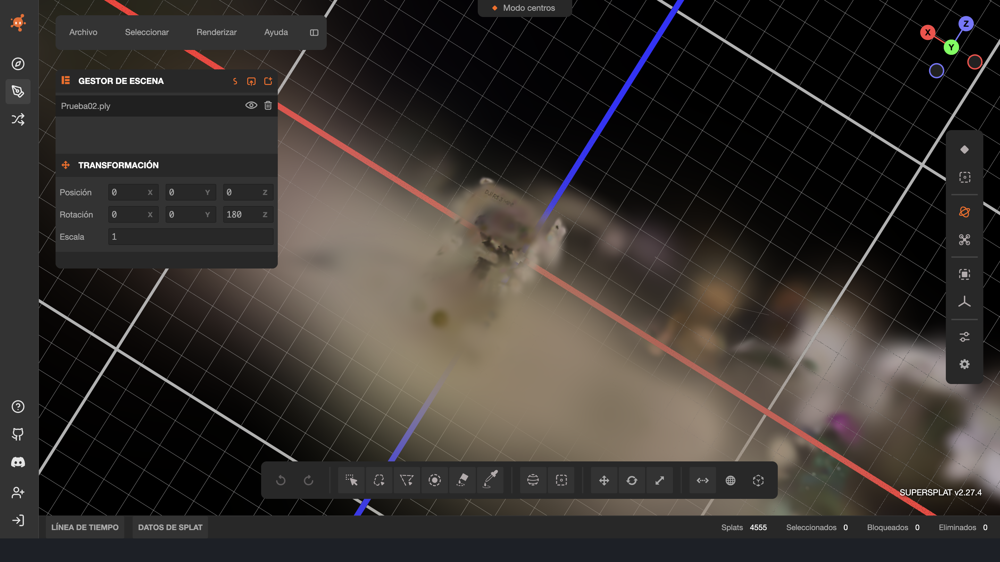

# Cloud Workstation v0.1 Functional Baseline Freeze Record

Fecha de cierre documental: 2026-06-29 (Aguascalientes, Aguascalientes)

Rama del acta: `release/v0.1-functional-baseline-freeze`

Clasificacion: acta oficial de baseline funcional con evidencia graduada

Alcance: Surveyor, handoff, Trainer, exportacion PLY y compatibilidad con SuperSplat

## Declaracion ejecutiva

Cloud Workstation v0.1 queda definido como una baseline funcional compuesta por dos identidades inmutables diferentes:

- Surveyor: commit `01b7f6876f0af933e610eb67a3583cb628ea2ddd`.
- Trainer usado por Prueba02: commit `90196251d59907754cc19caf76b59a737752893b`.

La evidencia demuestra el recorrido de 30 imagenes reales a una reconstruccion sparse normalizada, su transferencia y aceptacion por Trainer, un entrenamiento CUDA de 300 pasos, la exportacion de un PLY estructuralmente valido y su carga como 4,555 splats en SuperSplat v2.27.4.

El congelamiento no certifica convergencia, densificacion, calidad geometrica profesional, calidad de captura, calidad comercial ni aptitud de produccion.

> Baseline funcional v0.1 congelada con evidencia de extremo a extremo. La calidad profesional y comercial permanece fuera del alcance de esta validación.

## 1. Estado del proyecto al cierre

| Componente | Estado | Evidencia | Observacion |
| --- | --- | --- | --- |
| Surveyor headless | Validado | Prueba02, pruebas locales y CI | Reconstruccion sparse, seleccion y normalizacion verificadas |
| Handoff Surveyor a Trainer | Validado | Checksum, recepcion y dataset check | El digest exacto del scene archive no fue preservado |
| Trainer headless | Validado para smoke | Prueba02 | 300 pasos; no prueba convergencia |
| Checkpoint | Validado | `ckpt_299_rank0.pt` | Resultado esperado de `MAX_STEPS=300` |
| PLY estandar | Validado | Inspeccion independiente y SuperSplat | 4,555 vertices; sin NaN ni infinitos |
| PLY comprimido | Observado | Log de exportacion y reporte del operador | La inspeccion independiente completa no fue preservada |
| Transferencia `runpodctl` | Validada para Prueba02 | Registros de envio, recepcion y checksums disponibles | Robustez sobre 1 GB e interrupciones pendiente |
| Densificacion | Pendiente | 4,555 gaussianas iniciales y finales | No se puede afirmar crecimiento de gaussianas |
| Calidad profesional o comercial | Fuera de alcance | Declaracion expresa de ambos dossiers | No existe umbral aprobado |
| Delivery/Packager | Futuro | Sin implementacion | No forma parte de v0.1 |
| Full | Futuro | Sin implementacion | No forma parte de v0.1 |

Los terminos usados en esta acta son:

- **Validado:** respaldado por evidencia versionada, logs, pruebas ejecutables o artefactos inspeccionados.
- **Observado:** resultado visto y preservado, sin constituir una certificacion de calidad.
- **Reportado:** declaracion del operador o de un dossier sin artefacto primario suficiente para repetir la comprobacion.
- **Inferido:** relacion derivada de una cronologia inmutable, identificada expresamente como inferencia.
- **Pendiente:** no ejecutado o sin evidencia suficiente.
- **Fuera de alcance:** excluido deliberadamente de la baseline.

## 2. Identidad inmutable de Surveyor

| Campo | Valor | Grado |
| --- | --- | --- |
| Rama fuente | `headless-surveyor-v0.1-dev` | Verificado en Git |
| Commit congelado | `01b7f6876f0af933e610eb67a3583cb628ea2ddd` | Verificado en Git |
| Tree Git | `dfab7f533538683961ba63ba7d6b9e0d61df4cb7` | Verificado en Git |
| Workflow | `Publish Headless Surveyor Dev` | Verificado en GitHub Actions |
| Run | `28411071377` | Exitoso |
| Digest publicado | `sha256:51e9a9236cdc8c8351195709e5f0a864a01c62d4a79251f71e182219acdeb7d8` | Reportado directamente por `docker push` en CI |
| Tag de desarrollo | `docker.io/marquezmemo/cloud-workstation:headless-surveyor-v0.1-dev` | Mutable |
| Plataforma | `linux/amd64` | Workflow verificado |
| Imagen base | `colmap/colmap:20240723.601@sha256:73003557e3ffa36d801e71b7630c117f9d373c55f24e3afc6791b9b3d1ec01da` | Fijada por digest |

El digest de Surveyor fue contrastado con el log original de publicacion. No fue inspeccionado nuevamente desde un cliente Docker contra el registro; por ello el acta lo clasifica como **CI verificado, inspeccion independiente del registro pendiente**.

### Runtime y dependencias Surveyor

- COLMAP `3.10`, con evidencia runtime `3.10-dev`.
- Commit COLMAP `0bd66d901c7549051e21e8f648777f802eb20a73`.
- CUDA de imagen `12.3.1`.
- Ubuntu `22.04`.
- `gdown 6.1.0`.
- `runpodctl 2.5.0`, binario SHA-256 `f484ce7d790ddc6b4a63363f3c975c70fa87bf3be1bcbad019812f6e3f4ba54e`.
- Camara predeterminada `OPENCV`, `SINGLE_CAMERA=1`, matcher `exhaustive` y GPU habilitada.

## 3. Identidad inmutable de Trainer

La identidad validada por Prueba02 no es el HEAD actual de la rama Trainer.

| Campo | Runtime de Prueba02 | Fuente posterior |
| --- | --- | --- |
| Commit | `90196251d59907754cc19caf76b59a737752893b` | `221c4ef76a1ff5bfa8a9f45e5e9a084e8fbedfe3` |
| Tree Git | `9568224839eb12bfd0bfbca4625bdea3bfe7a8bb` | `f26a1a2fddd2f0a3398b3b49b5fbb61ea24038d5` |
| Workflow run | `28285526569` | `28413758338` |
| Resultado CI | Exitoso | Exitoso |
| Digest | `sha256:535822530f4b23fca3eee3970b147e3e979162a32c2e9de9f76a829836b63a89` | `sha256:726ac98c9678431fc34fbcc1de0bf07b71adbff215d672f04740a95999a6bf98` |
| Relacion con Prueba02 | Imagen atribuida al run por cronologia forense | Publicacion posterior; no usada por Prueba02 |
| `preparar-escena` | No disponible | Implementado y probado por regresion |

El workflow vincula directamente el digest `sha256:535822...b63a89` con el commit `9019625`. La asociacion de esa publicacion con el pod de Prueba02 es una **inferencia forense fuerte**: fue la ultima publicacion exitosa anterior a la prueba y el tag de desarrollo no se movio durante ella, pero el digest del pod no fue capturado en el transcript.

### Runtime y dependencias Trainer

- Imagen base `runpod/pytorch:2.4.0-py3.11-cuda12.4.1-devel-ubuntu22.04@sha256:61a4aafb0094cd773f11eefa378929d5a687bd775febeb78eac62fc824141fb5`.
- Python linea `3.11`; `3.11.10` observado anteriormente.
- PyTorch linea `2.4`; `2.4.1+cu124` observado anteriormente.
- CUDA linea `12.4`.
- `gsplat==1.5.3`.
- Ejemplos oficiales de gsplat en commit `937e29912570c372bed6747a5c9bf85fed877bae`.
- `opencv-python-headless==4.10.0.84`.
- `pycolmap` commit `cc7ea4b7301720ac29287dbe450952511b32125e`.
- `fused-ssim` commit `328dc9836f513d00c4b5bc38fe30478b4435cbb5`.
- `runpodctl 2.5.0`.

## 4. Commits Git

| Proposito | Commit |
| --- | --- |
| Surveyor congelado | `01b7f6876f0af933e610eb67a3583cb628ea2ddd` |
| Trainer validado por Prueba02 | `90196251d59907754cc19caf76b59a737752893b` |
| Documentacion Trainer Prueba02 | `ab775605669123858012dafa07f84fc5380cbba8` |
| Trainer posterior con importador seguro | `221c4ef76a1ff5bfa8a9f45e5e9a084e8fbedfe3` |
| Dossier Surveyor | `dbee66263957301a0b03cc8fe3d17e33f2083bcb` |
| Dossier Trainer | `c1431cdcac2316ec2f14f1576ec0405c1c4d9080` |

Los commits de dossier documentan y auditan; no sustituyen las identidades de runtime congeladas.

## 5. Tags Git

Los tags remotos existentes pertenecen a la linea historica de workstation y no identifican esta baseline funcional Surveyor/Trainer:

| Tag existente | Target remoto | Relacion con esta baseline |
| --- | --- | --- |
| `v0.1` | `0a4285c24c19c9ea745225df50257603f68f7324` | Ninguna; baseline historica |
| `workstation-v0.1` | `6220b2e3125e99bd49b28b363b8f3c03a52db59d` | Ninguna; baseline historica |

Tags recomendados, aun no declarados como creados por esta acta:

| Tag propuesto | Target obligatorio |
| --- | --- |
| `surveyor-v0.1.0-smoke-validated` | `01b7f6876f0af933e610eb67a3583cb628ea2ddd` |
| `trainer-v0.1.0-smoke-validated` | `90196251d59907754cc19caf76b59a737752893b` |

Los tags deben ser anotados, verificados despues de su creacion y protegidos contra movimiento o recreacion.

## 6. Tags y digests Docker

| Componente | Tag estable recomendado | Digest obligatorio | Estado |
| --- | --- | --- | --- |
| Surveyor | `docker.io/marquezmemo/cloud-workstation:headless-surveyor-v0.1.0` | `sha256:51e9a9236cdc8c8351195709e5f0a864a01c62d4a79251f71e182219acdeb7d8` | CI verificado; inspeccion independiente del registro pendiente |
| Trainer | `docker.io/marquezmemo/cloud-workstation:headless-gsplat-v0.1.0` | `sha256:535822530f4b23fca3eee3970b147e3e979162a32c2e9de9f76a829836b63a89` | Publicacion verificada; vinculacion al pod inferida |

Los tags estables deben copiar los manifests existentes por digest. **No se debe reconstruir ninguna imagen para crear los tags.** El digest posterior de Trainer `sha256:726ac98c...a6bf98` no debe recibir el tag estable v0.1 validado por Prueba02.

## 7. Diagrama funcional

```mermaid
flowchart LR
    A[Imagenes reales] --> B[Surveyor COLMAP]
    B --> C[Seleccion sparse]
    C --> D[Normalizacion sparse/0]
    D --> E[Scene archive + manifest + SHA-256]
    E --> F[Handoff runpodctl]
    F --> G[Trainer dataset check]
    G --> H[Entrenamiento CUDA]
    H --> I[Checkpoint]
    I --> J[PLY estandar y comprimido]
    J --> K[Transferencia]
    K --> L[SuperSplat v2.27.4]
```



Flujo validado para Prueba02:

```text
30 imagenes -> 2 modelos sparse -> modelo 1 seleccionado -> sparse/0
-> paquete + checksum -> Trainer -> 300 pasos -> ckpt_299_rank0.pt
-> Prueba02.ply -> 4,555 splats en SuperSplat v2.27.4
```

## 8. Contratos de entrada y salida

### Surveyor

Entrada:

- ZIP explicito o un unico ZIP detectable.
- Al menos dos imagenes no vacias en formatos soportados.
- Rutas seguras, sin enlaces simbolicos ni colisiones de nombres.

Salida:

```text
/workspace/scenes/<scene>/
  images/
  database.db
  sparse/0/{cameras.bin,images.bin,points3D.bin}
  sparse/<modelos secundarios>/
  surveyor-manifest.json
```

Paquetes:

```text
<scene>-surveyor-scene.tar.gz
<scene>-surveyor-scene.tar.gz.sha256
<scene>-surveyor-evidence.tar.gz
<scene>-surveyor-evidence.tar.gz.sha256
```

La seleccion sparse ordena por imagenes registradas, luego puntos y finalmente menor indice original. El ganador se normaliza a `sparse/0` sin borrar los modelos secundarios.

### Trainer validado

Entrada minima:

```text
/workspace/scenes/<scene>/
  images/
  sparse/0/cameras.bin
  sparse/0/images.bin
  sparse/0/points3D.bin
  surveyor-manifest.json
```

Salida:

```text
/workspace/outputs/<scene>/ckpts/ckpt_<step>_rank<rank>.pt
/workspace/outputs/<scene>/exports/<scene>.ply
/workspace/outputs/<scene>/exports/<scene>.compressed.ply
/workspace/logs/<scene>/
```

El importador `preparar-escena` pertenece a `221c4ef`, posterior al runtime congelado de Prueba02. Para restaurar exactamente `9019625`, la extraccion sigue siendo manual.

## 9. Comandos operativos

### Surveyor

```bash
preparar-escena /workspace/<scene>.zip
validate-surveyor.sh
survey-scene.sh <scene>
validate-surveyor-scene.sh <scene>
package-surveyor-scene.sh <scene>
sha256sum -c <scene>-surveyor-scene.tar.gz.sha256
runpodctl send <scene>-surveyor-scene.tar.gz
runpodctl send <scene>-surveyor-scene.tar.gz.sha256
```

### Trainer congelado

```bash
# Recibir y verificar el archivo antes de extraerlo.
runpodctl receive <transfer-code>
sha256sum -c Prueba02-surveyor-scene.tar.gz.sha256

# El runtime 9019625 requiere extraccion manual segura.
mkdir -p /workspace/scenes
tar -xzf Prueba02-surveyor-scene.tar.gz -C /workspace/scenes

train-scene.sh --check Prueba02
MAX_STEPS=300 train-scene.sh Prueba02
generar --scene Prueba02
empaquetar Prueba02
runpodctl send /workspace/outputs/Prueba02/exports/Prueba02-ply-exports.tar.gz
```

Los codigos efimeros de `runpodctl` no forman parte del acta.

## 10. Evidencia de Prueba02

### Surveyor

| Metrica | Resultado | Estado |
| --- | ---: | --- |
| Imagenes de entrada | 30 | Validado |
| Imagenes en database | 30 | Validado |
| Camaras | 1 | Validado |
| Modelo | `OPENCV` | Validado |
| Modelos sparse | 2 | Validado |
| Modelo original seleccionado | 1 | Validado |
| Imagenes registradas | 30 | Validado |
| Puntos | 4,555 | Validado |
| Observaciones | 19,928 | Validado |
| Track medio | 4.374973 | Validado |
| Error de reproyeccion | 1.133537 px | Validado; no es umbral comercial |
| Evidence archive SHA-256 | `03d4f4f764e8dc4a53cff4b029781cd31877ec5c795db9f39b6e962dfed21157` | Recalculado en la documentacion Prueba02; no repetido por el dossier Surveyor |

### Trainer y PLY

| Metrica | Resultado | Estado |
| --- | ---: | --- |
| Scene archive | 741.1 MB; UI 777 MB | Reportado y versionado |
| Checksum de entrada | Correcto | Validado; digest exacto no preservado |
| Profundidad | 300 pasos | Validado |
| Duracion | 2:20 | Validado |
| Throughput | 2.13 it/s | Validado |
| Loss final | 0.196 | Observado; no es score de calidad |
| Checkpoint | `ckpt_299_rank0.pt` | Validado |
| Gaussianas iniciales/finales | 4,555 / 4,555 | Validado; sin densificacion demostrada |
| PLY estandar | 1,076,455 bytes | Validado |
| PLY comprimido | 280,894 bytes | Validado por log |
| PLY estandar SHA-256 | `f7acbb332667a028756f7f2426dd07bfde577f66f30ef0dfa27b02449eea5c71` | Inspeccion independiente |
| Formato estandar | `binary_little_endian` | Inspeccion independiente |
| Vertices/propiedades | 4,555 / 59 float | Inspeccion independiente |
| No finitos estandar | 0 NaN, 0 infinitos | Inspeccion independiente |
| SuperSplat | 4,555 splats, v2.27.4 | Validado por captura |

La captura demuestra carga y renderizado, no calidad profesional o comercial.



## 11. Tratamiento OPENCV y undistortion

Prueba02 uso una camara COLMAP `OPENCV`. Surveyor no ejecuta `colmap image_undistorter`; conserva las imagenes y parametros de distorsion de la reconstruccion.

El parser fijado de gsplat lee `fx`, `fy`, `cx`, `cy`, `k1`, `k2`, `p1` y `p2`; calcula una matriz corregida, construye los mapas de rectificacion, ejecuta `cv2.remap`, recorta al ROI valido y entrega imagen y matriz corregidas al entrenamiento. La advertencia de camara no PINHOLE no significa que la distorsion sea ignorada.

Politica v0.1:

- mantener Surveyor `OPENCV` y el unico remap de Trainer;
- no introducir undistortion en Surveyor dentro de v0.1;
- cambiar geometria de imagen y metadatos de camara como un solo contrato en v0.2;
- probar explicitamente cualquier cambio para evitar doble undistortion.

La comparacion de calidad OPENCV frente a un flujo PINHOLE/undistorted permanece pendiente.

## 12. Que protege el congelamiento

El congelamiento protege:

- commits y trees Git exactos;
- manifests Docker existentes por digest;
- imagenes base y dependencias fijadas;
- seleccion y normalizacion sparse;
- contrato de manifest, paquetes y checksums;
- parser y patch headless del Trainer;
- formato de checkpoint y exportacion PLY;
- comandos y layout persistente usados por Prueba02;
- evidencia, clasificacion y limitaciones de Prueba02.

No protege tiempos de descarga, velocidad de transferencia, disponibilidad de terceros, rendimiento futuro de GPU ni reproducibilidad bit a bit de una reconstruccion nueva.

## 13. Procedimiento de restauracion

### Restaurar Surveyor

1. Verificar que el tag Git aprobado resuelva exactamente a `01b7f6876f0af933e610eb67a3583cb628ea2ddd`.
2. Inspeccionar el manifest estable y confirmar `sha256:51e9a923...deb7d8`.
3. Pull por digest, no por el tag mutable de desarrollo.
4. Montar almacenamiento persistente en `/workspace`.
5. Ejecutar `validate-surveyor.sh`.
6. Restaurar archives y comprobar cada `.sha256` antes del handoff.

### Restaurar Trainer

1. Verificar que el tag Git aprobado resuelva exactamente a `90196251d59907754cc19caf76b59a737752893b`.
2. Pull por digest:

   ```text
   docker.io/marquezmemo/cloud-workstation@sha256:535822530f4b23fca3eee3970b147e3e979162a32c2e9de9f76a829836b63a89
   ```

3. Montar `/workspace` persistente.
4. Restaurar scene archive y checksum.
5. Verificar checksum y extraer manualmente bajo `/workspace/scenes`.
6. Ejecutar `train-scene.sh --check Prueba02`.
7. Si se requiere replay funcional, usar `MAX_STEPS=300`, exportar con `generar --scene Prueba02` y comparar conteos y tamanos.

El replay no sustituye los artefactos originales ni convierte una observacion en certificacion de calidad.

## 14. Limitaciones

- El digest del pod Trainer no fue capturado durante Prueba02.
- El digest exacto del scene archive no fue preservado.
- Scene archive, checkpoint, PLY y logs completos no estan versionados.
- La inspeccion independiente de no finitos del PLY comprimido no fue preservada.
- Las dependencias transitivas de Trainer no estan totalmente fijadas con hashes.
- El checksum de `empaquetar` en el runtime validado contiene una ruta absoluta.
- No se validaron archivos mayores a 1 GB, interrupcion, resume o throughput estable.
- La compilacion CUDA inicial de 61.61 s y la descarga AlexNet de 233 MB son observaciones, no garantias.
- Un smoke de 300 pasos no prueba convergencia.

## 15. Deuda tecnica

- Capturar digest del pod en cada run real.
- Preservar hashes y tamanos de scene archive, checkpoint y ambos PLY.
- Hacer portable el checksum de `empaquetar`.
- Empaquetar telemetria GPU continua y logs completos por escena.
- Fijar dependencias transitivas de Trainer.
- Validar el importador `preparar-escena` posterior a Prueba02 en un pod real.
- Evaluar densificacion, PSNR, SSIM, LPIPS y renders comparables.
- Definir protocolo de captura y criterios de calidad en una fase separada.
- Validar transferencias grandes y recuperacion ante interrupciones.

## 16. Politica de ramas v0.2

Despues de crear y verificar los tags inmutables:

- crear `headless-surveyor-v0.2-dev` desde `01b7f6876f0af933e610eb67a3583cb628ea2ddd`;
- crear `headless-gsplat-v0.2-dev` desde `90196251d59907754cc19caf76b59a737752893b`;
- incorporar de forma explicita y revalidar las mejoras posteriores, incluido `221c4ef`;
- prohibir pushes directos en las ramas v0.1;
- requerir PR, checks y revision para cambios de contrato;
- no mover tags v0.1 ni reutilizar sus nombres;
- no publicar sobre los tags Docker estables desde workflows de desarrollo.

Esta acta recomienda la politica; no crea ramas v0.2 ni modifica reglas remotas.

## 17. Linea futura Delivery/Packager

Delivery/Packager es una linea futura, no implementada. Su responsabilidad propuesta es recibir artefactos ya generados, verificar checksums, crear paquetes portables, registrar procedencia y facilitar transferencias reanudables sin incorporar entrenamiento o COLMAP.

No debe presentarse como existente, validada o incluida en v0.1.

## 18. Linea futura Full

Full es una imagen futura que podria integrar Surveyor y Trainer cuando sus contratos sean estables. No existe una imagen Full funcional congelada, no fue usada por Prueba02 y no forma parte de esta baseline.

Su desarrollo debe comenzar en v0.2 o posterior, sin alterar los tags o digests v0.1.

## 19. Conflictos y matriz de trazabilidad

### Conflictos y diferencias temporales

| Tema | Surveyor dossier | Trainer dossier | Tratamiento oficial |
| --- | --- | --- | --- |
| Extraccion Trainer | Manual y pendiente de automatizar | `preparar-escena` agregado en `221c4ef` | Para el runtime congelado `9019625` fue manual; la automatizacion es posterior |
| Digest Surveyor | CI reportado; inspeccion independiente pendiente | No redefine Surveyor | Mantener la reserva; no promover a inspeccion independiente |
| Digest Trainer de Prueba02 | Registra handoff, no digest del pod | Asociacion por cronologia inmutable | Clasificar como inferencia forense fuerte |
| OPENCV | Comparacion PINHOLE pendiente | Parser realiza un remap real | No hay contradiccion: comportamiento validado, comparacion de calidad pendiente |
| PLY comprimido | Fuera del alcance Surveyor | No finitos reportados sin raw inspector | No declarar inspeccion independiente |
| Calidad | No profesional/comercial | No profesional/comercial | Fuera de alcance |

### Trazabilidad

| Seccion del acta | Surveyor Freeze Report | Trainer Freeze Report | Prueba02 |
| --- | --- | --- | --- |
| Estado e identidades | 1, 2, 9 | 1, 3, 4 | Ambos registros |
| Arquitectura y contratos | 3, 5, 6, 8 | 7, 8, 9, 11 | Surveyor y Trainer |
| Dependencias | 4 | 5, 6 | Manifests |
| Prueba02 | 10 | 12 | Registros preservados |
| OPENCV | 7, 8, 12 | 10 | Ambos registros |
| Limitaciones y riesgos | 12, 13 | 14, 15 | Ambos registros |
| Recuperacion | 14 | 16 | Contratos y checksums |
| Freeze | 15, 16 | 17, 19 | Esta acta |

## 20. Checksums y cadena de custodia

El archivo autoritativo `output/pdf/SHA256SUMS` cubre:

- esta acta Markdown;
- esta acta PDF;
- los dos dossiers PDF recibidos;
- los dos reportes Markdown fuente;
- los dos manifests JSON fuente;
- los handoffs y SHA256SUMS originales;
- los dos registros versionados de Prueba02;
- la captura sanitizada de SuperSplat.

El propio archivo `SHA256SUMS` queda excluido para evitar una referencia hash recursiva. La verificacion se ejecuta desde la raiz del repositorio con:

```bash
shasum -a 256 -c output/pdf/SHA256SUMS
```

## Recomendaciones posteriores al dossier

Una vez revisada y aceptada esta acta:

1. Crear los tags Git inmutables propuestos en sus commits exactos.
2. Inspeccionar los manifests existentes desde un cliente de registro autorizado.
3. Crear tags Docker estables copiando los digests existentes, sin rebuild.
4. Verificar que cada tag estable resuelva al mismo digest.
5. Aplicar proteccion contra pushes directos en las ramas v0.1.
6. Crear las ramas v0.2 desde los commits congelados y reintroducir mejoras posteriores mediante commits revisables.

Estas acciones son recomendaciones y requieren autorizacion operativa independiente. No fueron ejecutadas por esta acta.

## Conclusion oficial

> Baseline funcional v0.1 congelada con evidencia de extremo a extremo. La calidad profesional y comercial permanece fuera del alcance de esta validación.
